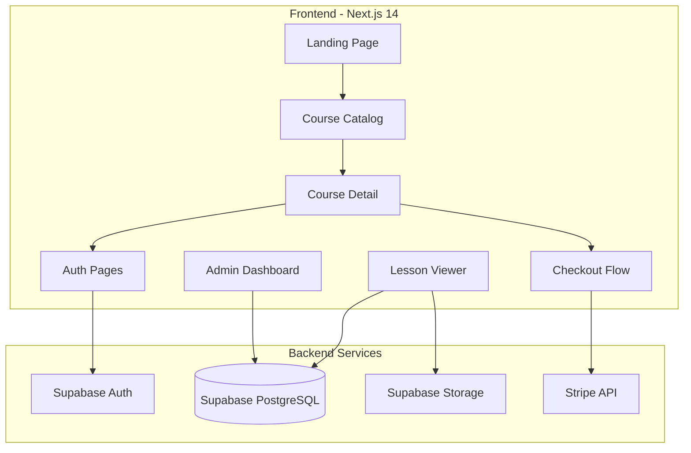
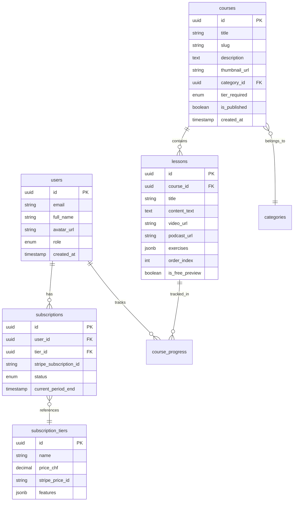

# Tutorio - Online Tutoring Platform

## Architecture Overview




## Tech Stack

| Layer | Technology ||-------|------------|| Framework | Next.js 14 (App Router) || Styling | Tailwind CSS + shadcn/ui components || Database | Supabase (PostgreSQL) || Authentication | Supabase Auth || File Storage | Supabase Storage (videos, podcasts, PDFs) || Payments | Stripe (Subscriptions + Checkout) || Deployment | Vercel (recommended) |

## Database Schema




## Key Features Implementation

### 1. Authentication Flow

- Supabase Auth with email/password and magic link options
- Protected routes using Next.js middleware
- User profile management with role-based access (user/admin)

### 2. Landing Page and Course Catalog

- Hero section with value proposition
- Course grid with filtering by category
- Search functionality
- Pricing section showing both tiers (Basic: 10 CHF, Premium: 25 CHF)

### 3. Course Detail and Freemium Model

- Course overview with curriculum preview
- First lesson(s) marked as free preview
- Clear CTA to subscribe for full access
- Locked content indicators for premium lessons

### 4. Subscription and Payment Flow

- Stripe Checkout for seamless payment
- Webhook handlers for subscription events
- Automatic access management based on subscription status
- Support for both Basic and Premium tiers

### 5. Lesson Viewer

- Markdown/rich text content for lessons
- Embedded video player (for Premium tier)
- Audio player for podcasts (for Premium tier)
- Interactive exercises with answer checking
- Progress tracking

### 6. Admin Dashboard

- Course management (CRUD operations)
- Lesson editor with rich text and media uploads
- User management and subscription overview
- Analytics dashboard (subscribers, revenue, popular courses)

## Project Structure

```javascript
tutorio/
├── app/
│   ├── (auth)/
│   │   ├── login/
│   │   └── signup/
│   ├── (main)/
│   │   ├── courses/
│   │   │   ├── [slug]/
│   │   │   └── page.tsx
│   │   ├── lessons/
│   │   │   └── [id]/
│   │   └── pricing/
│   ├── (admin)/
│   │   └── admin/
│   │       ├── courses/
│   │       ├── users/
│   │       └── analytics/
│   ├── api/
│   │   ├── webhooks/
│   │   │   └── stripe/
│   │   └── checkout/
│   ├── layout.tsx
│   └── page.tsx
├── components/
│   ├── ui/
│   ├── courses/
│   ├── lessons/
│   └── admin/
├── lib/
│   ├── supabase/
│   ├── stripe/
│   └── utils/
├── types/
└── supabase/
    └── migrations/
```


## Implementation Phases

### Phase 1: Foundation

- Project setup with Next.js 14, Tailwind, shadcn/ui
- Supabase integration and database schema
- Authentication system
- Basic landing page

### Phase 2: Core Features

- Course catalog and detail pages
- Lesson viewer with free preview logic
- Stripe integration and checkout flow
- Subscription management

### Phase 3: Content and Admin

- Admin dashboard with course/lesson management
- Media upload functionality (videos, podcasts)
- Exercise builder
- Progress tracking

### Phase 4: Polish

- Responsive design refinements
- SEO optimization
- Performance optimization
- Analytics integration

## Legal Compliance Notes