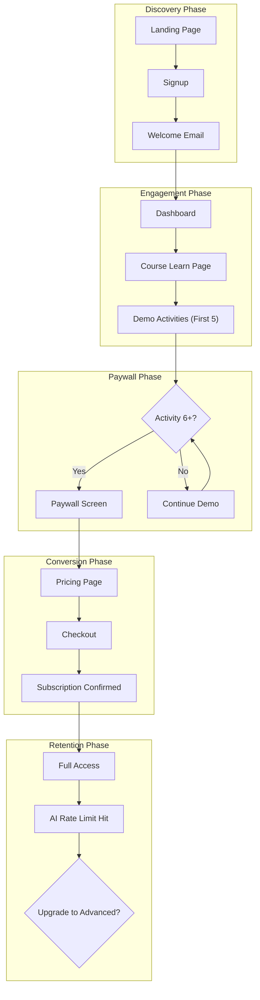

# Selling Funnel Review and Upgrade Incentive Strategy

**Date:** January 2026  
**Status:** Implementation in Progress

---

## Executive Summary

After analyzing the codebase, we've identified the complete user journey from signup to conversion. The current funnel has upgrade touchpoints but they are underutilized, lack urgency, and miss key conversion moments. This report outlines the current state and provides actionable recommendations.

---

## Current Funnel Architecture

---

## Current Upgrade Touchpoints Analysis

### Existing Touchpoints (6 Total)

| Location | Implementation | Effectiveness |
|----------|----------------|---------------|
| Dashboard Course Cards | Small "Upgrade" button | LOW - Subtle, easy to miss |
| Pricing Page | Full plan comparison | MEDIUM - Only seen if user navigates there |
| Activity Paywall | Lock screen with upgrade link | MEDIUM - Reactive, not proactive |
| AI Chat Rate Limit | Error message in chat | LOW - Text only, no clear CTA |
| Subscription Page | Plan comparison table | LOW - Only for existing subscribers |
| Course Hero Card | Upgrade button with Zap icon | MEDIUM - Visible but not compelling |

### Key Code Locations

**Dashboard Upgrade Button:** `src/app/(protected)/dashboard/page.tsx` (lines 597-604)
- Small border button with Zap icon
- Easy to overlook in the UI

**Paywall Screen:** `src/app/(protected)/skills/[skillSlug]/[activitySlug]/page.tsx` (lines 108-137)
- Basic lock screen with minimal messaging
- No value proposition or pricing preview

**AI Rate Limit Error:** `src/app/api/chat/route.ts` (lines 124-144)
- Returns 429 error with text message
- Handled as error text in chat widget, no actionable CTA

---

## Identified Gaps and Missing Opportunities

### High-Impact Missing Touchpoints

| # | Touchpoint | Location | Current State | Gap |
|---|------------|----------|---------------|-----|
| 1 | Post-Demo Completion Prompt | After completing demo activities | Shows "Lesson Complete" only | No prompt about remaining free activities or upgrade value |
| 2 | AI Usage Indicator | Chat widget header | No usage visibility | Missing "3/5 messages used today" counter |
| 3 | Profile Page Upgrade Section | `src/app/(protected)/profile/page.tsx` | Shows stats only | Missing subscription status card with upgrade CTA |
| 4 | Course Learn Page Hero | `src/app/(protected)/courses/[slug]/learn/page.tsx` | Progress card only | Missing subscription tier badge and upgrade prompt |
| 5 | Locked Skill Preview Cards | Skills tab on course learn page | Just shows lock icon | Missing "Unlock with Basic" overlay with pricing |
| 6 | Success Moment Modals | Quiz/Challenge completion | Shows score and XP | Missing upsell opportunity after positive experience |
| 7 | Email Nurture Sequence | `src/lib/email/templates/` | Only welcome, subscription-confirmed, subscription-ended | Missing Day 3 engagement and Day 7 upgrade reminder emails |
| 8 | Course Cards Upgrade Buttons | All course cards except landing page | No upgrade CTA | Missing upgrade button on course cards |

### Low-Friction Opportunities

| # | Opportunity | Implementation |
|---|-------------|----------------|
| 8 | Courses Listing Page Subscription Badges | Show "Free Demo" or "Subscribed (Basic)" badges on course cards |
| 9 | Settings Page Subscription Section | Add subscription management shortcut |
| 10 | Chat Widget Upgrade Banner | Show remaining messages as a progress bar when under 50% |

---

## Implementation Plan

### Priority 1: Immediate Wins (High Impact, Low Effort)

| Change | Location | Effort | Status |
|--------|----------|--------|--------|
| Add usage counter to chat widget header | `src/components/chat/chat-widget.tsx` | 2 hours | Pending |
| Enhance paywall with value proposition | `src/app/(protected)/skills/[skillSlug]/[activitySlug]/page.tsx` | 2 hours | Pending |
| Add upgrade CTA after demo activity completion | `src/components/activities/lesson-viewer.tsx` | 3 hours | Pending |
| Add subscription status to profile page | `src/app/(protected)/profile/page.tsx` | 2 hours | Pending |

### Priority 2: Strategic Additions (Medium Effort)

| Change | Location | Effort | Status |
|--------|----------|--------|--------|
| Create UpgradePromptCard component | `src/components/stripe/upgrade-prompt-card.tsx` | 3 hours | Pending |
| Add locked skill preview with pricing | `src/app/(protected)/courses/[slug]/learn/page.tsx` | 4 hours | Pending |
| Create post-quiz success upsell modal | New component | 4 hours | Pending |
| Add course subscription badges | `src/app/(protected)/courses/page.tsx` | 2 hours | Pending |

### Priority 3: Email Nurture (Higher Effort)

| Change | Location | Effort | Status |
|--------|----------|--------|--------|
| Create Day 3 engagement email template | `src/lib/email/templates/day3-engagement.ts` | 2 hours | Pending |
| Create Day 7 upgrade reminder template | `src/lib/email/templates/day7-upgrade-reminder.ts` | 2 hours | Pending |
| Set up email trigger logic | Backend/cron job | 4 hours | Future |

---

## Detailed Implementation Specifications

### 1. UpgradePromptCard Component

**Purpose:** Reusable component for consistent upgrade CTAs across the application.

**Props:**
- `courseSlug: string` - The course to upgrade
- `courseName: string` - Display name
- `variant: 'inline' | 'card' | 'banner' | 'modal'` - Display variant
- `currentTier?: 'free' | 'basic'` - User's current tier
- `showPricing?: boolean` - Whether to show pricing
- `context?: string` - Context message (e.g., "Unlock 15 more activities")

**Variants:**
- `inline` - Small inline button with icon
- `card` - Full card with features and CTA
- `banner` - Horizontal banner for headers
- `modal` - Full modal overlay

### 2. Enhanced Paywall Screen

**Current state:** Basic lock screen with minimal messaging

**Improvements:**
- Add course-specific value proposition
- Show count of locked activities (e.g., "15 more activities")
- Include pricing: "Starting at CHF 8/mo"
- Add feature highlights (AI Tutor, All Activities, etc.)
- Primary CTA: "Subscribe to Unlock"
- Secondary CTA: "View All Plans"

### 3. AI Chat Usage Indicator

**Location:** Chat widget header

**Components:**
- Progress bar showing messages used/remaining
- Text: "5/5 messages used" or "3/25 remaining"
- Tier badge: "Free", "Basic", "Advanced"
- Upgrade link when usage > 50%

**API Integration:**
- Fetch from `getUserRateLimit()` action
- Update after each message sent

### 4. Post-Demo Completion Modal

**Trigger:** When completing activity 5 (last free activity) in a skill

**Content:**
- Congratulations message
- Progress summary: "You've completed 5 free activities"
- Value proposition: "Subscribe to unlock 15+ more activities"
- Pricing options
- Primary CTA: "Subscribe Now"
- Dismiss option (doesn't block user)

### 5. Profile Subscription Card

**Location:** Profile page, after stats section

**Content:**
- Current subscriptions list
- Per-course tier badge
- Renewal date
- Quick upgrade button for Basic users
- Link to subscription management

### 6. Locked Skill Overlay

**Location:** Skill cards on course learn page when locked

**Content:**
- Semi-transparent overlay
- Lock icon
- "Unlock with Basic"
- Price: "CHF 8/mo"
- Quick subscribe button

### 7. Course Subscription Badges

**Location:** Course cards on courses listing page

**Badge Types:**
- "Free Demo" - Not subscribed
- "Basic" - Basic subscription
- "Advanced" - Advanced subscription
- "Upgrade Available" - Basic user, can upgrade

---

## Metrics to Track

| Metric | Current Baseline | Target | Tracking Method |
|--------|------------------|--------|-----------------|
| Paywall to pricing page CTR | Unknown | 15%+ | Click tracking |
| Demo to paid conversion rate | Unknown | 3-5% | Funnel analytics |
| Basic to Advanced upgrade rate | Unknown | 10%+ | Subscription events |
| AI rate limit to upgrade CTR | Unknown | 5%+ | Click tracking |
| Chat usage indicator engagement | N/A | 20%+ | Interaction tracking |

---

## Files Modified/Created

### New Files
- `src/components/stripe/upgrade-prompt-card.tsx` - Reusable upgrade component
- `src/lib/email/templates/day3-engagement.ts` - Day 3 email template
- `src/lib/email/templates/day7-upgrade-reminder.ts` - Day 7 email template

### Modified Files
- `src/components/chat/chat-widget.tsx` - Add usage indicator
- `src/app/(protected)/skills/[skillSlug]/[activitySlug]/page.tsx` - Enhanced paywall
- `src/components/activities/lesson-viewer.tsx` - Demo completion prompt
- `src/app/(protected)/profile/page.tsx` - Subscription status card
- `src/app/(protected)/courses/[slug]/learn/page.tsx` - Skill overlay
- `src/app/(protected)/courses/page.tsx` - Subscription badges
- `src/components/stripe/index.ts` - Export new component

---

## Changelog

| Date | Change | Author |
|------|--------|--------|
| 2026-01-07 | Initial funnel review and plan created | AI Assistant |
| 2026-01-07 | Implementation started | AI Assistant |

