# Business Mathematics - Skill Dependency Map

**Generated:** January 9, 2026
**Total Skills:** 47
**Total Prerequisites:** 48

---

## Visual Dependency Diagram

```mermaid
flowchart TB
    subgraph mod1[Module 1: Math Foundations]
        MF01[Arithmetic Fundamentals]
        MF02[Order of Operations]
        MF03[Number Types]
        MF04[Calculator Proficiency]
    end
    
    subgraph mod2[Module 2: Basic Statistics]
        ST01[Arithmetic Mean]
        ST02[Weighted Averages]
        ST03[Summation Notation]
        ST04[Central Tendency]
    end
    
    subgraph mod3[Module 3: Ratios and Percentages]
        RP01[Fraction Operations]
        RP02[Ratios and Proportions]
        RP03[Percentage Calculations]
        RP04[Percentage Change]
        RP05[Markup and Margin]
        RP06[Index Numbers]
    end
    
    subgraph mod4[Module 4: Exponents and Logarithms]
        EL01[Exponent Rules]
        EL02[Neg/Frac Exponents]
        EL03[Scientific Notation]
        EL04[Logarithm Basics]
        EL05[Logarithm Rules]
        EL06[Compound Interest]
        EL07[Continuous Compounding]
        EL08[Time Value of Money]
    end
    
    subgraph mod5[Module 5: Equations]
        EQ01[Linear Equations]
        EQ02[Equation Manipulation]
        EQ03[Quadratic Equations]
        EQ04[Systems of Two]
        EQ05[Systems of Three]
        EQ06[Matrix Notation]
    end
    
    subgraph mod6[Module 6: Functions and Graphs]
        FG01[Function Notation]
        FG02[Linear Functions]
        FG03[Quadratic Functions]
        FG04[Polynomial Functions]
        FG05[Exponential Functions]
        FG06[Graph Interpretation]
    end
    
    subgraph mod7[Module 7: Differential Calculus]
        DC01[Limits and Continuity]
        DC02[Derivative Concept]
        DC03[Basic Derivative Rules]
        DC04[Product/Quotient Rules]
        DC05[Chain Rule]
        DC06[Higher-Order Derivatives]
        DC07[Partial Derivatives]
        DC08[Optimization]
        DC09[Constrained Optimization]
    end
    
    subgraph mod8[Module 8: Integral Calculus]
        IC01[Antiderivatives]
        IC02[Definite Integrals]
        IC03[Integration Techniques]
        IC04[Consumer/Producer Surplus]
    end
    
    %% Module 1 to Module 2
    MF01 --> ST01
    MF02 --> ST03
    
    %% Module 2 internal
    ST01 --> ST02
    ST01 --> ST04
    
    %% Module 1 to Module 3
    MF01 --> RP01
    
    %% Module 3 internal
    RP01 --> RP02
    RP01 --> RP03
    RP03 --> RP04
    RP04 --> RP05
    
    %% Module 2 to Module 3
    ST02 --> RP06
    
    %% Module 1 to Module 4
    MF02 --> EL01
    
    %% Module 4 internal
    EL01 --> EL02
    EL01 --> EL03
    EL02 --> EL04
    EL04 --> EL05
    EL02 --> EL06
    RP04 --> EL06
    EL06 --> EL07
    EL04 --> EL07
    EL07 --> EL08
    
    %% Module 1 to Module 5
    MF02 --> EQ01
    
    %% Module 5 internal
    EQ01 --> EQ02
    EQ01 --> EQ03
    EL02 --> EQ03
    EQ01 --> EQ04
    EQ04 --> EQ05
    EQ05 --> EQ06
    
    %% Module 5 to Module 6
    EQ01 --> FG01
    
    %% Module 6 internal
    FG01 --> FG02
    FG02 --> FG03
    EQ03 --> FG03
    FG03 --> FG04
    FG02 --> FG05
    EL06 --> FG05
    FG02 --> FG06
    
    %% Module 6 to Module 7
    FG02 --> DC01
    
    %% Module 7 internal
    DC01 --> DC02
    DC02 --> DC03
    DC03 --> DC04
    DC03 --> DC05
    DC03 --> DC06
    DC05 --> DC07
    DC06 --> DC08
    DC08 --> DC09
    DC07 --> DC09
    
    %% Module 7 to Module 8
    DC03 --> IC01
    
    %% Module 8 internal
    IC01 --> IC02
    IC02 --> IC03
    DC05 --> IC03
    IC02 --> IC04
    FG06 --> IC04
```



---

## Prerequisite Chain Details

### Entry Points (No Prerequisites)
These skills can be started immediately:

| Skill | Name | Module |
|-------|------|--------|
| MF-01 | Arithmetic Fundamentals | Math Foundations |
| MF-02 | Order of Operations | Math Foundations |
| MF-03 | Number Types | Math Foundations |
| MF-04 | Calculator Proficiency | Math Foundations |

---

### Prerequisite Matrix

#### Module 2: Basic Statistics

| Skill | Prerequisites | Status |
|-------|---------------|--------|
| Arithmetic Mean | Arithmetic Fundamentals | OK |
| Weighted Averages | Arithmetic Mean | OK |
| Summation Notation | Order of Operations | OK |
| Central Tendency | Arithmetic Mean | OK |

#### Module 3: Ratios & Percentages

| Skill | Prerequisites | Status |
|-------|---------------|--------|
| Fraction Operations | Arithmetic Fundamentals | OK |
| Ratios and Proportions | Fraction Operations | OK |
| Percentage Calculations | Fraction Operations | OK |
| Percentage Change | Percentage Calculations | OK |
| Markup and Margin | Percentage Change | OK |
| Index Numbers | Weighted Averages | Cross-module link |

#### Module 4: Exponents & Logarithms

| Skill | Prerequisites | Status |
|-------|---------------|--------|
| Exponent Rules | Order of Operations | OK |
| Neg/Frac Exponents | Exponent Rules | OK |
| Scientific Notation | Exponent Rules | OK |
| Logarithm Basics | Neg/Frac Exponents | OK |
| Logarithm Rules | Logarithm Basics | OK |
| Compound Interest | Percent Change + Neg/Frac Exponents | Multi-prereq |
| Continuous Compounding | Compound Interest + Logarithm Basics | Multi-prereq |
| Time Value of Money | Continuous Compounding | OK |

#### Module 5: Equations

| Skill | Prerequisites | Status |
|-------|---------------|--------|
| Linear Equations | Order of Operations | OK |
| Equation Manipulation | Linear Equations | OK |
| Quadratic Equations | Linear Equations + Neg/Frac Exponents | Multi-prereq |
| Systems of Two | Linear Equations | OK |
| Systems of Three | Systems of Two | OK |
| Matrix Notation | Systems of Three | OK |

#### Module 6: Functions & Graphs

| Skill | Prerequisites | Status |
|-------|---------------|--------|
| Function Notation | Linear Equations | Cross-module |
| Linear Functions | Function Notation | OK |
| Quadratic Functions | Linear Functions + Quadratic Equations | Multi-prereq |
| Polynomial Functions | Quadratic Functions | OK |
| Exponential Functions | Linear Functions + Compound Interest | Multi-prereq |
| Graph Interpretation | Linear Functions | OK |

#### Module 7: Differential Calculus

| Skill | Prerequisites | Status |
|-------|---------------|--------|
| Limits and Continuity | Linear Functions | Cross-module |
| Derivative Concept | Limits and Continuity | OK |
| Basic Derivative Rules | Derivative Concept | OK |
| Product/Quotient Rules | Basic Derivative Rules | OK |
| Chain Rule | Basic Derivative Rules | OK |
| Higher-Order Derivatives | Basic Derivative Rules | OK |
| Partial Derivatives | Chain Rule | OK |
| Optimization | Higher-Order Derivatives | OK |
| Constrained Optimization | Optimization + Partial Derivatives | Multi-prereq |

#### Module 8: Integral Calculus

| Skill | Prerequisites | Status |
|-------|---------------|--------|
| Antiderivatives | Basic Derivative Rules | Cross-module |
| Definite Integrals | Antiderivatives | OK |
| Integration Techniques | Definite Integrals + Chain Rule | Multi-prereq |
| Consumer/Producer Surplus | Definite Integrals + Graph Interpretation | Multi-prereq |

---

## Dependency Analysis

### Cross-Module Dependencies (12)

These connections require knowledge from earlier modules:

1. Statistics -> Ratios: Weighted Averages -> Index Numbers
2. Foundations -> Equations: Order of Operations -> Linear Equations
3. Ratios -> Exponents: Percentage Change -> Compound Interest
4. Equations -> Functions: Linear Equations -> Function Notation
5. Exponents -> Equations: Neg/Frac Exponents -> Quadratic Equations
6. Functions -> Calculus: Linear Functions -> Limits and Continuity
7. Exponents -> Functions: Compound Interest -> Exponential Functions
8. Calculus -> Integration: Basic Derivative Rules -> Antiderivatives
9. Calculus -> Integration: Chain Rule -> Integration Techniques
10. Functions -> Integration: Graph Interpretation -> Consumer/Producer Surplus
11. Equations -> Functions: Quadratic Equations -> Quadratic Functions
12. Calculus -> Optimization: Partial Derivatives -> Constrained Optimization

### Multi-Prerequisite Skills (8)

Skills requiring knowledge from multiple sources:

| Skill | Prerequisites |
|-------|---------------|
| Compound Interest | Percentage Change + Neg/Frac Exponents |
| Continuous Compounding | Compound Interest + Logarithm Basics |
| Quadratic Equations | Linear Equations + Neg/Frac Exponents |
| Quadratic Functions | Linear Functions + Quadratic Equations |
| Exponential Functions | Linear Functions + Compound Interest |
| Constrained Optimization | Optimization + Partial Derivatives |
| Integration Techniques | Definite Integrals + Chain Rule |
| Consumer/Producer Surplus | Definite Integrals + Graph Interpretation |

---

## Struggling Student Analysis

### Critical Path (Longest Prerequisite Chain)

The longest dependency chain is 10 skills:

```
Order of Operations (MF-02)
    -> Exponent Rules (EL-01)
        -> Neg/Frac Exponents (EL-02)
            -> Logarithm Basics (EL-04)
                -> Continuous Compounding (EL-07)
                    -> Time Value of Money (EL-08)
```

**Impact:** A student struggling with Order of Operations will face cascading difficulties across exponents, logarithms, and financial calculations.

### Rescue Points

If a student struggles, these are the best intervention points:

| Struggle Point | Rescue Strategy |
|----------------|-----------------|
| Arithmetic Fundamentals | Review basic math facts, practice with simple numbers |
| Order of Operations | Use PEMDAS mnemonics, visual step-by-step examples |
| Fraction Operations | Practice with visual fraction models |
| Exponent Rules | Use pattern recognition, power of 2 tables |
| Linear Equations | Balance method with physical analogy |
| Derivative Concept | Focus on rate of change intuition before formulas |

### Orphan Skills (No Prerequisites, Not Entry Level)

All non-entry skills have proper prerequisites defined. No orphan skills detected.

### Missing Bridge Check

| From | To | Bridge Exists? | Notes |
|------|----|----------------|-------|
| Ch0 Prerequisites | Module 1 | YES | Direct alignment |
| Ch1 Averages | Module 2 | YES | Direct alignment |
| Ch2 Fractions/Percentages | Module 3 | YES | Direct alignment |
| Ch3 Exponents/Logs | Module 4 | YES | Direct alignment |
| Ch4 Single-Variable Equations | Module 5 | YES | Linear Equations |
| Ch5 Functions/Graphs | Module 6 | YES | Direct alignment |
| Ch6 Systems of Equations | Module 5 | YES | Combined correctly |
| Ch7 Intro Derivatives | Module 7 | YES | Direct alignment |
| Ch9 Partial Derivatives | Module 7 | YES | Included in Module 7 |
| Ch10 Optimization | Module 7 | YES | Included in Module 7 |
| Ch11 Integration | Module 8 | YES | Direct alignment |

**Verdict:** Prerequisite chains align well with EHL chapter order.

---

## Recommendations

### For Struggling Students

1. **Ensure Module 1 mastery** before advancing - all other content builds on this foundation
2. **Spend extra time on Order of Operations** - it's a critical junction point
3. **Don't skip Exponent Rules** - they unlock logarithms, compound interest, and quadratic equations
4. **Review Percentage Change before Compound Interest** - many students struggle with the connection

### Content Gaps to Address

1. Add remedial activities for students who fail prerequisites
2. Consider optional "bridge" lessons for cross-module dependencies
3. Create "skill reset" paths for students who need to restart

---

*This map will be referenced during content analysis to verify prerequisite coverage.*

